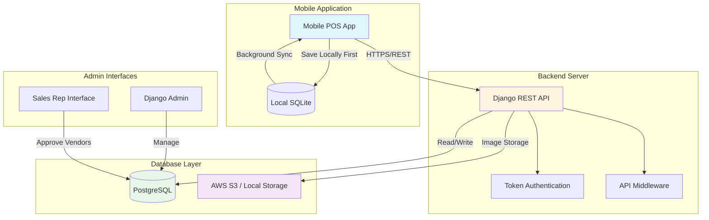
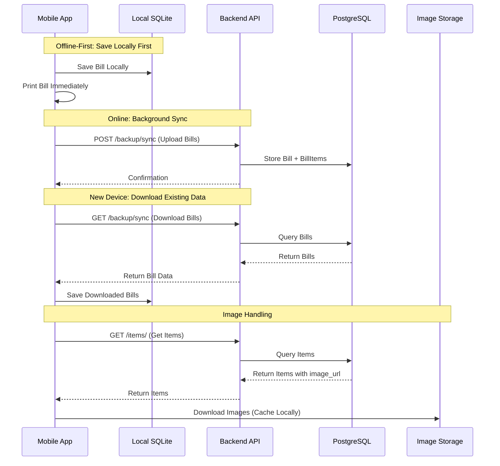
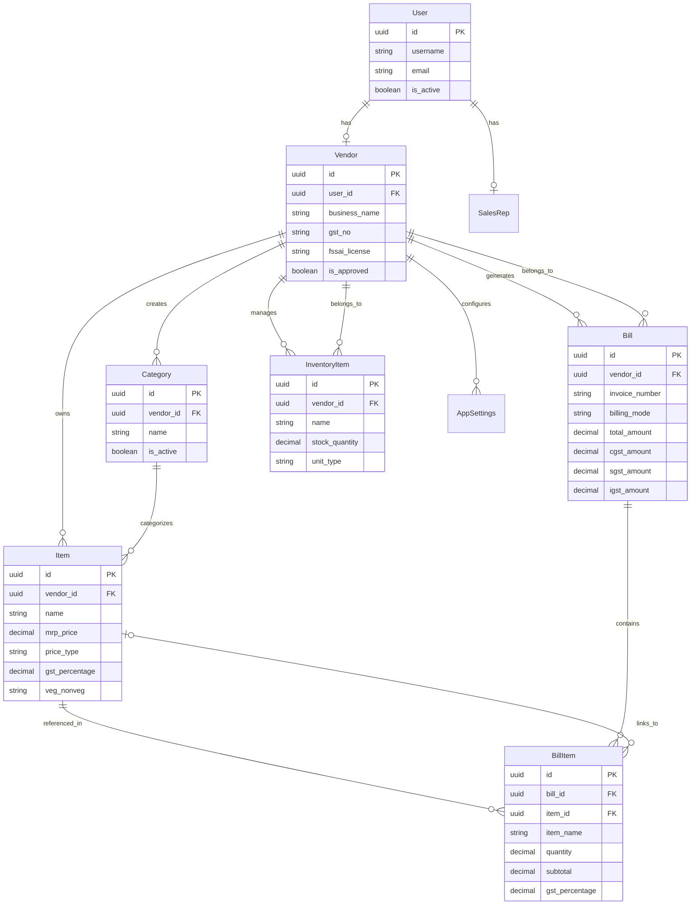
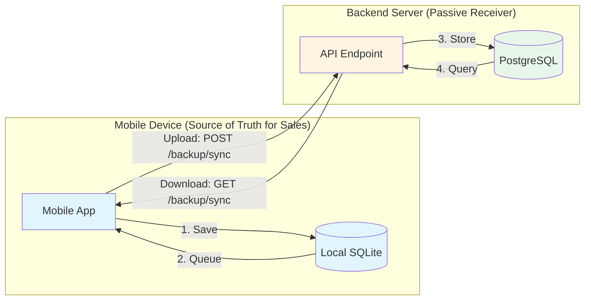

# Offline-First Billing App - Backend Server

Django + PostgreSQL backend for the offline-first billing application. This system provides a RESTful API for mobile POS applications with support for GST/Non-GST billing, bi-directional sync, and structured bill storage.

---

## Table of Contents

- [Documentation Guide](#documentation-guide)
- [Quick Start](#quick-start)
- [System Architecture](#system-architecture)
- [Data Models](#data-models)
- [Default Accounts](#default-accounts)
- [Key API Endpoints](#key-api-endpoints)
- [Testing](#testing)
- [Project Structure](#project-structure)
- [Key Features](#key-features)
- [Running the Server](#running-the-server)

---

## Documentation Guide

This README serves as the main entry point. For detailed documentation, refer to the following:

### For Mobile App Developers
1. **[MOBILE_APP_GUIDE.md](MOBILE_APP_GUIDE.md)** - Complete integration guide with code examples
   - **Bill Creation Examples:** All billing modes (GST intra-state, inter-state, Non-GST), all payment modes (cash, UPI, card, credit, other), with/without discounts
   - **Item Creation Examples:** All GST percentages (0%, 5%, 8%, 18%, custom), exclusive/inclusive pricing, with/without images
   - **Offline-First Implementation:** Complete code examples for offline sync
2. **[API_DOCUMENTATION.md](API_DOCUMENTATION.md)** - Full API reference with all endpoints
   - **16 Complete Bill Examples:** Every possible combination of billing mode, payment mode, discounts, linked/additional items
   - **12 Complete Item Examples:** All GST percentages, price types, with/without images, veg/non-veg
   - **Dashboard Examples:** All date range filters, billing mode filters
3. **[TEST_ACCOUNTS.md](TEST_ACCOUNTS.md)** - All test credentials and accounts

### For Backend Developers
1. **[SETUP.md](SETUP.md)** - Detailed setup instructions
2. **[BACKEND_TESTING.md](BACKEND_TESTING.md)** - How to test everything
   - Test cases for all billing modes
   - Test cases for all payment modes
   - Test cases for all GST percentages
3. **[STORAGE_CONFIGURATION.md](STORAGE_CONFIGURATION.md)** - Image storage setup (Local/S3 with pre-signed URLs)
4. **[AUTHENTICATION_FLOW.md](AUTHENTICATION_FLOW.md)** - Auth flow details
5. **[ENDPOINTS_SUMMARY.md](ENDPOINTS_SUMMARY.md)** - Quick endpoint reference
6. **[ADMIN_PANEL_GUIDE.md](ADMIN_PANEL_GUIDE.md)** - Django admin panel guide (vendor management, staff users, security PIN)

### Quick Reference: Where to Find What

**Billing & Payment Examples:**
- **GST Bills (Intra-State):** [API_DOCUMENTATION.md](API_DOCUMENTATION.md#example-1-gst-bill---intra-state---cash-payment---no-discounts) - Examples 1-5
- **GST Bills (Inter-State):** [API_DOCUMENTATION.md](API_DOCUMENTATION.md#example-6-gst-bill---inter-state---cash-payment---no-discounts) - Examples 6-7
- **Non-GST Bills:** [API_DOCUMENTATION.md](API_DOCUMENTATION.md#example-9-non-gst-bill---cash-payment---no-discounts) - Examples 9-10
- **Bills with Discounts:** [API_DOCUMENTATION.md](API_DOCUMENTATION.md#example-8-gst-bill---intra-state---cash-payment---with-discounts) - Example 8, 16
- **All Payment Modes:** [API_DOCUMENTATION.md](API_DOCUMENTATION.md#payment-mode-summary) - Cash, UPI, Card, Credit, Other
- **Code Examples:** [MOBILE_APP_GUIDE.md](MOBILE_APP_GUIDE.md#example-1-gst-bill---intra-state---cash-payment) - Complete JavaScript/React Native examples

**Item Creation Examples:**
- **All GST Percentages:** [API_DOCUMENTATION.md](API_DOCUMENTATION.md#example-1-item-with-0-gst---exclusive-pricing---without-image---veg) - Examples 1-5
- **Price Types (Exclusive/Inclusive):** [API_DOCUMENTATION.md](API_DOCUMENTATION.md#example-6-item-with-18-gst---inclusive-pricing---without-image---veg) - Example 6
- **With/Without Images:** [API_DOCUMENTATION.md](API_DOCUMENTATION.md#example-7-item-with-18-gst---exclusive-pricing---with-image---veg) - Example 7
- **Veg/Non-Veg:** [API_DOCUMENTATION.md](API_DOCUMENTATION.md#example-8-item-with-18-gst---exclusive-pricing---without-image---non-veg) - Example 8
- **Multiple Categories:** [API_DOCUMENTATION.md](API_DOCUMENTATION.md#example-10-item-with-multiple-categories) - Example 10

**Dashboard & Analytics:**
- **All Dashboard Endpoints:** [API_DOCUMENTATION.md](API_DOCUMENTATION.md#dashboard--analytics) - Complete examples with all filters
- **Date Range Filters:** [API_DOCUMENTATION.md](API_DOCUMENTATION.md#dashboard-stats) - start_date, end_date examples
- **Billing Mode Filters:** [API_DOCUMENTATION.md](API_DOCUMENTATION.md#sales-analytics) - GST/Non-GST filtering

**Business Details & Profile:**
- **Vendor Profile:** [API_DOCUMENTATION.md](API_DOCUMENTATION.md#vendor-profile) - GET/PATCH examples
- **Logo Upload:** [API_DOCUMENTATION.md](API_DOCUMENTATION.md#update-vendor-profile) - multipart/form-data examples

---

## Quick Start

Run the automated setup script:

```bash
./setup.sh
```

This automatically:
- Sets up virtual environment
- Installs all dependencies
- Creates database and runs migrations
- Creates admin user (`admin` / `admin123`)
- Creates sales rep user (`salesrep1` / `salesrep123`)
- Creates test vendors (approved and pending)
- Creates mobile developer account (`mobiledev` / `mobile123`) with comprehensive test data
- Creates test categories and items

**Mobile Developer Account (Created by setup.sh):**
- Username: `mobiledev`
- Password: `mobile123`
- Includes: 15+ items with images, 8 categories, sample bills (GST & Non-GST)

See [SETUP.md](SETUP.md) for detailed setup instructions.

---

## System Architecture

### High-Level Architecture



### Data Flow Architecture



### Model Relationships



### Sync Flow Architecture



---

## Data Models

### Core Models

**Vendor** - Represents business entities using the POS system
- One-to-one relationship with Django User
- Contains business information (name, GST, FSSAI, logo, footer note)
- Approval status managed by Sales Rep or Admin

**Item** - Products/services sold by vendors
- Many-to-one with Vendor
- Many-to-many with Category
- Includes GST fields (mrp_price, price_type, gst_percentage, veg_nonveg)
- Images stored in S3 or local filesystem

**Category** - Organizes items (Breakfast, Lunch, Dinner, etc.)
- Can be vendor-specific or global (vendor=None)
- Many-to-many with Item

**Bill** - Sales transaction header
- One-to-many with Vendor
- One-to-many with BillItem
- Stores billing mode (GST/Non-GST), tax breakdown, payment info
- Unique constraint: (vendor, invoice_number)

**BillItem** - Individual line items in a bill
- Many-to-one with Bill
- Optional link to master Item (for historical accuracy)
- Stores snapshot of item details at time of sale

**InventoryItem** - Raw materials inventory
- Many-to-one with Vendor
- Tracks stock quantities with 16 unit types
- Supports low stock alerts

### Key Design Principles

1. **Offline-First**: Mobile device is source of truth for sales data
2. **UUID Primary Keys**: All models use UUIDs for better offline sync
3. **Structured Storage**: Bills stored in relational format (Bill + BillItem) for extendability
4. **Bi-Directional Sync**: Download existing bills for new devices
5. **Passive Receiver**: Server accepts bill data without validation

---

## Default Accounts

Created by `setup.sh`:

### Admin & Sales Rep
- **Admin:** `admin` / `admin123` (Django Admin: `http://localhost:8000/admin/`)
- **Sales Rep:** `salesrep1` / `salesrep123` (Sales Rep Interface: `http://localhost:8000/sales-rep/`)

### Approved Vendors (Ready to Use)
- **Vendor 1:** `vendor1` / `vendor123` (ABC Store)
- **Vendor 2:** `vendor2` / `vendor123` (XYZ Restaurant)
- **Mobile Dev:** `mobiledev` / `mobile123` (Mobile Dev Restaurant - For Mobile Developers)

### Pending Vendor (For Testing)
- **Pending Vendor:** `pendingvendor` / `pending123` (Pending Business)

---

## Key API Endpoints

### Authentication
- `POST /auth/login` - Login and get token
- `POST /auth/register` - Register new vendor
- `POST /auth/logout` - Logout

### Items & Categories
- `GET /items/` - Get all items (with filters: category, search, is_active)
- `POST /items/` - Create item
- `GET /items/categories/` - Get all categories
- `POST /items/categories/` - Create category

### Sales Backup (Bi-Directional Sync)
- `GET /backup/sync` - Download bills from server (for new devices)
  - Query params: `since`, `limit`, `billing_mode`, `start_date`, `end_date`
- `POST /backup/sync` - Upload bills to server (background sync)
  - Accepts single bill or array of bills
  - Duplicate bills automatically skipped

### Inventory
- `GET /inventory/` - Get all inventory items
- `POST /inventory/` - Create inventory item
- `PATCH /inventory/<uuid>/stock/` - Update stock (set/add/subtract)

See [API_DOCUMENTATION.md](API_DOCUMENTATION.md) for complete API reference.

---

## Testing

### Comprehensive Endpoint Testing

Run comprehensive tests for all endpoints:

```bash
source venv/bin/activate
python verify_all_endpoints.py
```

This tests:
- All models and fields
- All URL patterns
- Authentication system
- All API endpoints (60+ tests including image uploads)
- Error handling and edge cases
- Image uploads (multipart/form-data)
- Bi-directional sync
- GST/Non-GST billing

### Default Setup Verification

Verify that all default accounts and test data are present:

```bash
source venv/bin/activate
python verify_default_setup.py
```

This verifies:
- Default accounts (admin, salesrep, vendors, mobiledev)
- Test data (categories, items, bills)
- Mobile developer data (15+ items, 8 categories, sample bills)
- API access with default credentials
- Image URLs accessibility

See [BACKEND_TESTING.md](BACKEND_TESTING.md) for testing guide.

---

## Project Structure

```
pos/
├── backend/          # Django project settings
├── auth_app/         # Authentication & vendor management
├── items/            # Products/items management app
├── inventory_app/    # Raw materials inventory management
├── sales/            # Sales backup app (Bill + BillItem models)
├── settings/         # Settings backup app
├── sales_rep/        # Sales rep web interface
├── manage.py
└── requirements.txt
```

---

## Key Features

### Core Features
- **Token Authentication:** All endpoints protected with token-based authentication
- **Last-Write-Wins:** Inventory updates use timestamps for conflict resolution
- **Passive Receiver:** Sales endpoint accepts any bill data without validation
- **UUID Primary Keys:** All models use UUIDs for better offline sync
- **CORS Enabled:** Configured for mobile app access

### Advanced Features
- **Billing Modes:** Support for both GST and Non-GST billing modes per bill
- **GST Tax Details:** Full support for CGST, SGST, and IGST in GST bills
- **Structured Bill Storage:** Bills stored in relational format (Bill + BillItem models) for extendability
- **Bi-Directional Sync:** Download bills from server (GET /backup/sync) for new devices
- **Item Images:** Support for item images with local/S3 storage toggle
- **Pre-Signed URLs:** Secure, temporary URLs for S3 images (no public bucket needed, enabled by default)
- **Health Check:** `/health/` endpoint for monitoring and load balancers
- **Comprehensive Logging:** API, error, and audit logging with rotation
- **Sales Rep Interface:** Mobile-friendly web UI for vendor approval
- **Multi-Category Support:** Items can belong to multiple categories
- **Offline Sync:** Batch sync endpoints for categories and items
- **Inventory Management:** Complete raw materials inventory system with 16 unit types, stock tracking, low stock alerts

---

## Running the Server

```bash
source venv/bin/activate
python manage.py runserver
```

The API will be available at `http://localhost:8000/`

**Health Check:**
```bash
curl http://localhost:8000/health/
```

---

## Documentation Files

### Essential Documentation
- **README.md** (this file) - Main guide and documentation index
- **MOBILE_APP_GUIDE.md** - Complete mobile app integration guide
- **API_DOCUMENTATION.md** - Full API reference with examples
- **TEST_ACCOUNTS.md** - All test credentials and accounts

### Setup & Configuration
- **SETUP.md** - Detailed setup instructions
- **STORAGE_CONFIGURATION.md** - Image storage setup (Local/S3)
- **AUTHENTICATION_FLOW.md** - Auth flow and backward compatibility

### Reference
- **BACKEND_TESTING.md** - Testing guide
- **ENDPOINTS_SUMMARY.md** - Quick endpoint reference

---

## Need Help?

- **Mobile App Integration:** See [MOBILE_APP_GUIDE.md](MOBILE_APP_GUIDE.md)
- **API Questions:** See [API_DOCUMENTATION.md](API_DOCUMENTATION.md)
- **Setup Issues:** See [SETUP.md](SETUP.md)
- **Testing:** See [BACKEND_TESTING.md](BACKEND_TESTING.md)

---

**Last Updated:** 2026-01-22
